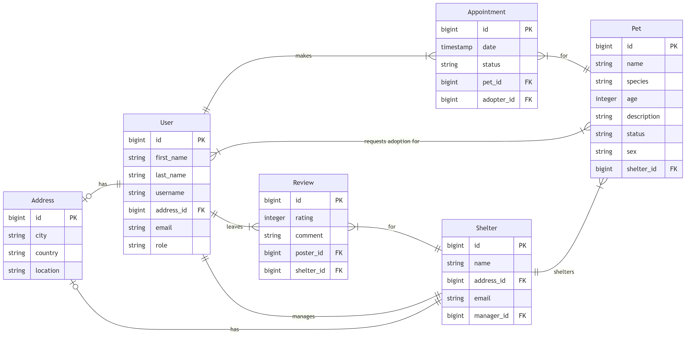

# Pawsy ~ Pet Adoption System
## Business Requirements and MVP Features

### I. Business Domain Overview

Pawsy is designed to connect **animal shelters** with **individual adopters**. The system
facilitates browsing, requesting, adopting pets, scheduling appointments to meet with the pets and interacting with the shelter through a simple and user-friendly platform. The backend is powered by Java Spring Boot, with a relational database to store all persistent data.

### II. Business Requirements

| Nr. | Requirement | Description |
| --: | ----------- | ----------- |
|  1. | Shelter Registration | The system must allow shelters to register their details (name, contact information, and location) to manage adoptable pets. |
|  2. | Pet Listing Management | Shelters must be able to add, update, and remove pets from their listings. |
|  3. | View Available Pets | Users must be able to view all pets currently available for adoption, with filters such as species, age, shelter etc. |
|  4. | Adoption Request Submission | Users must be able to submit adoption requests for specific pets. |
|  5. | Adoption Request Management | Shelters must be able to view, approve, or reject adoption requests linked to their pets. |
|  6. | Appointment Scheduling | Users must be able to schedule an appointment to meet and find out more about the pets. |
|  7. | Review System | Users must be able to leave reviews for shelters they interacted with (e.g., rating and comment). |
|  8. | Pet Status Tracking | The system must automatically update the pet's status (Available, Adopted, Awaiting) based on adoption outcomes. |
|  9. | Shelter Appointments | Shelters must be able to view their upcoming appointments to prepare for their visitors. |
| 10. | Adopter Registration | Adopters must be able to register their details (first name, last name, address information and contact information) to adopt managed pets. |

### III. Features
### Feature 1 ~ Pet Management

**Requirements:** 2., 3. & 8. \
**Description:** Shelters can create, edit, and remove pet listings, including details such as name, species, age, description, current status and sex. Users can browse and filter available pets. Users can view statistics about the total registered pets and total adopted pets. Shelters can also update a pet's information and status. \
**Actions:**
  * Add a new pet. (**POST** /api/pets)
  * Delete a registered pet. (**DELETE** /api/pets/{id})
  * Update a registered pet. (**PUT** /api/pets/{id})
  * Get a list of all pets with possible filtering. (**GET** /api/pets)
  * Get a list of all adopted pets by a particular adopter (user). (**GET** /api/adopters/{id}/pets)
  * Get a particular pet. (**GET** /api/pets/{id})
  * Get pet statistics. (**GET** /api/pets/stats)
  * Filter by shelter id, species, status, sex and age range.

### Feature 2 ~ Adoption Requests

**Requirements:** 4., 5., 8. & 10. \
**Description:** Users can send requests to adopt pets. Shelters can view and manage these requests, approving or rejecting them. \
**Actions:**
  * Submit an adoption request for a pet. (**POST** /api/adopters/{adopterId}/pets/{petId}/adoption-request)
  * Delete an adoption request. (**DELETE** /api/adoption-requests)
  * Update an adoption request's status (Approved or Rejected). (**PUT** /api/adoption-requests/{id})
  * Approve an adoption request. (**POST** /api/adoption-requests/{id}/approve)
  * Reject an adoption request. (**POST** /api/adoption-requests/{id}/reject)
  * Get a particular adoption request. (**GET** /api/adoption-requests/{id})
  * Get a list of all adoption requests with possible filtering. (**GET** /api/adoption-requests)
  * Get an adopter's adoption requests. (**GET** /api/adopters/{id}/adoption-requests)
  * Filter by adopter id, pet id and status.

### Feature 3 ~ Appointment Scheduling

**Requirements:** 6., 9. & 10. \
**Description:** Users can schedule appointments to meet and find out more about their favourite pets. A pet can only be booked for an appointment once per day. \
**Actions:**
  * Submit an appointment for a pet. (**POST** /api/adopters/{adopterId}/pets/{petId}/appointment)
  * Delete an appointment. (**DELETE** /api/appointments)
  * Update an appointment's date and status (Done or Cancelled). (**PUT** /api/appointments/{id})
  * Get a particular appointment. (**GET** /api/appointments/{id})
  * Get a list of all appointments with possible filtering. (**GET** /api/appointments)
  * Get an adopter's appointments. (**GET** /api/adopters/{id}/appointments)
  * Filter by adopter id, pet id and date range.

### Feature 4 ~ Shelter Management

**Requirements:** 1., 2., 5. & 9. \
**Description:** Shelters can register, view, and manage their information as well as the pets under their care and the appointments they will organize. \
**Actions:**
  * Register a new shelter. (**POST** /api/shelters)
  * Delete a registered shelter. (**DELETE** /api/shelters/{id})
  * Update a registered shelter. (**PUT** /api/shelters/{id})
  * Get a list of all shelters with possible filtering. (**GET** /api/shelters)
  * Get a particular shelter. (**GET** /api/shelters/{id})
  * Get a shelter's average rating. (**GET** /api/shelters/{id}/average-rating)
  * Get a shelter's upcoming appointments. (**GET** /api/shelters/{id}/upcoming-appointments)
  * Get a list of a particular shelter's pets. (**GET** /api/shelters/{id}/pets)
  * Filter by location.

### Feature 5 ~ Review System

**Requirements:** 1., 7. & 10. \
**Description:** Users can leave reviews for shelters they have interacted with, including ratings (between 1 and 5) and comments. \
**Actions:**
  * Submit a review for a shelter. (**POST** /api/shelters/{id}/review)
  * Delete a review. (**DELETE** /api/reviews/{id})
  * Update a review's rating or comment. (**PUT** /api/reviews/{id})
  * Get a particular review. (**GET** /api/reviews{id})
  * Get a list of all reviews with possible filtering. (**GET** /api/reviews)
  * Filter by adopter id, shelter id, rating range.
  * Limit the number of reviews returned using `limit` and sort them by rating using `sort`.

### Feature 6 ~ Adopter Management

**Requirements:** 3., 4., 6. & 10. \
**Description:** Users can register, view, and manage their information as well as interacting with the available shelters and their pets through requests, appointments and reviews. \
**Actions:**
  * Add a new adopter. (**POST** /api/adopters)
  * Delete a registered adopter. (**DELETE** /api/adopters/{id})
  * Update a registered adopter. (**PUT** /api/adopters/{id})
  * Get a list of all adopters with possible filtering. (**GET** /api/adopters)
  * Get a list of all adopted pets by a particular adopter (user). (**GET** /api/adopters/{id}/pets)
  * Get a particular adopter. (**GET** /api/adopters/{id})
  * Filter by first name and last name.

### IV. Entities
There are 7 entities:

* User
* Address
* Shelter
* **Pet**
* Appointment
* Review
* AdoptionRequest

with the following relationships:


* 1 (*explicit*) Many to Many
* 3 One to One
* 5 One to Many / Many to One

### V. Architecture
### 1. Monolithic Pawsy

Monolithic Pawsy (*mono*) is a Spring Boot MVC web application for managing pets, shelters and adoption requests & multiple interactions with the pets.

### Overview

The application follows a layered architecture with domain-based modularization to allow an easier migration to micorservices:

Client (Browser) &mdash; Thymeleaf Views &mdash; Controllers (Spring MVC) &mdash; Services (Business Logic) &mdash; Repositories (Spring Data JPA) &mdash; Database (MySQL or H2)

### VI. Setup
### IDE (Build System)

Preferably IntelliJ with Maven & JDK 21.

### Additional Tools

Docker (Desktop or CLI + Compose).

### Instructions

* Choose a project (*mono* or *micro*).
* Create a dot env following the example ones or just the needed variables for **arch/** and for every service.
* Start every needed container:
  - For *mono*:
```bash
docker compose -f arch/docker/docker-compose.mono.yml up -d
```
* Open the chosen project in an IDE or just build with Maven (clean + package).
* Run the application from the IDE or directly using a Java Runtime.
